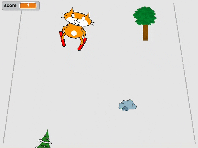
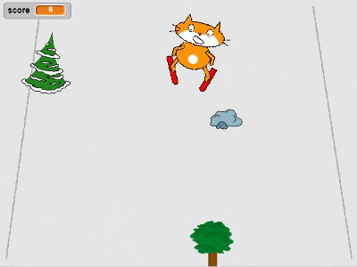

--- no-print ---

This is the **Scratch 2** version of the project. There is also a [Scratch 3 version of the project](https://projects.raspberrypi.org/en/projects/scratch-cat-goes-skiing).

--- /no-print ---

## Introduction

You are going to use Scratch to create a skiing game in which you have to avoid randomly appearing obstacles to score points.

### What you will make

--- no-print ---

--- /no-print ---

--- print-only ---

--- /print-only ---

--- collapse ---

---
title: What you will need
---

### Hardware

+ A computer capable of running Scratch

### Software

+ Scratch 2.0 [offline](http://rpf.io/scratchoff){:target="_blank"})

--- /collapse ---

--- collapse ---

---
title: What you will learn
---

+ How to control sprites using the keyboard
+ How to draw a backdrop
+ How to animate sprites
+ Use random numbers

--- /collapse ---

--- collapse ---
---
title: Additional information for educators
---

--- no-print ---

If you need to print this project, please use the [printer-friendly version](https://projects.raspberrypi.org/en/projects/scratch-cat-goes-skiing-scratch2/print){:target="_blank"}.

--- /no-print ---

You can [find the solution for this project here](http://rpf.io/p/en/scratch-cat-goes-skiing-scratch2-get){:target="_blank"}.

--- /collapse ---
