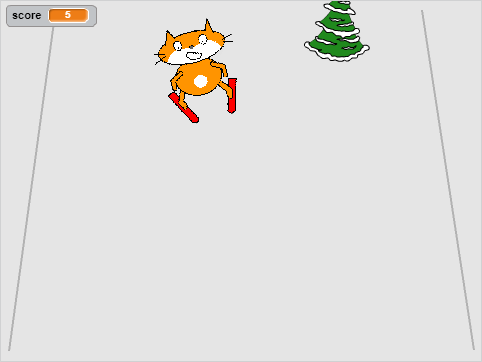

## Adding a score

Each time the skier sprite makes it past an obstacle, they should earn points.



--- task ---

`Make a variable`{:class="blockdata"} called `score`{:class="blockdata"} 

--- /task ---

--- task ---

Add a script to the obstacle sprite to set `score`{:class="blockdata"} to zero at the start of the game.

[[[generic-scratch-add-variable]]]

```blocks
when green flag clicked
set [score v] to [0]
```

--- /task ---

--- task ---

Change the code so that when the obstacle gets to the top of the screen, it `changes score by 1`{:class="blockdata"}.

The updated script for the sprite should look like this:

```blocks
when green flag clicked
set [score v] to [0]
forever 
    set [obstacle_x v] to (pick random (-200) to (200))
    go to x: (obstacle_x) y: (-180)
    show
    glide (1) secs to x: (obstacle_x) y: (180)
    hide
    wait (0.5) secs
+   change [score v] by (1)
end
```
--- /task ---

--- task ---

Play the game, see how many points you can score.

--- /task ---